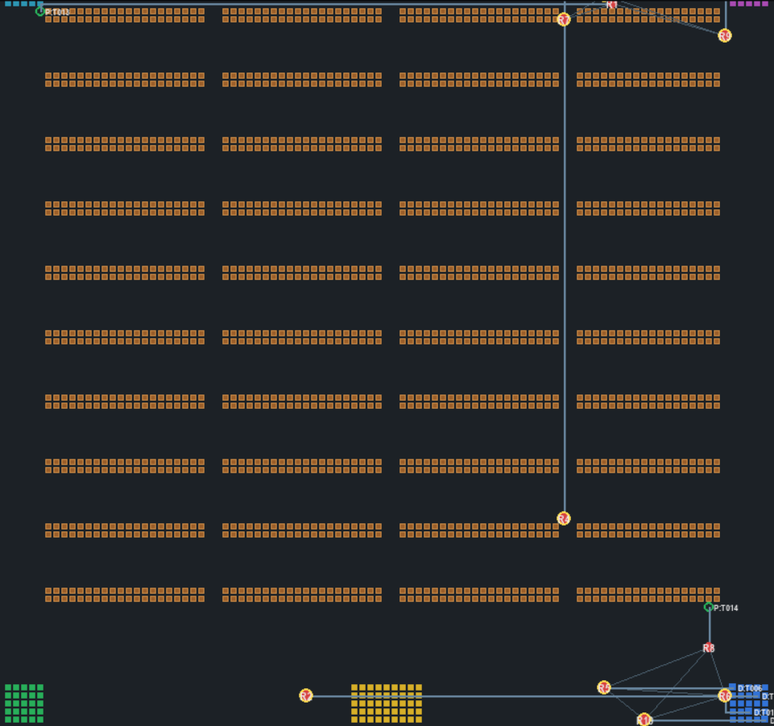

# Warehouse Robot Coordination System

A Python-based decentralized multi-robot warehouse coordination system designed to reduce dependency on a central controller.

The system combines multi-hop mesh communication, task bidding, path planning, time-based path reservation, collision detection, conflict resolution, and deadlock recovery to coordinate multiple warehouse robots.

## Key Features

### Decentralized Robot Coordination

Robots participate in a distributed communication network rather than relying entirely on a single central controller.

### Multi-Hop Mesh Communication

- Robots dynamically maintain communication links with nearby robots.
- Robot state information can be shared across the active mesh.
- The communication layer supports multi-hop routes between robots.

### Task Bidding and Assignment

- Available robots evaluate tasks based on factors such as battery level, distance, availability, and task priority.
- Eligible robots participate in the bidding process.
- Tasks are assigned to suitable robots based on the bidding logic.

### Path Planning

The system generates movement proposals for robots and coordinates their paths through the warehouse environment.

### Path Reservation

Robots reserve future positions and movement edges to reduce conflicts between simultaneously moving robots.

### Collision Avoidance

The coordinator checks multiple types of conflicts before allowing robots to move:

- Vertex conflicts
- Target conflicts
- Edge/swap conflicts
- Physical occupancy conflicts

### Deadlock Recovery

The system monitors robot progress and attempts recovery when robots become stuck or enter a deadlock situation.

### Multi-Robot Simulation

The system is designed to coordinate multiple robots simultaneously in a warehouse environment.

## System Architecture

The system is organized around the following components:

**Task Generator**

Creates pickup and drop tasks for the warehouse.

↓

**Task Bidding**

Evaluates available robots using task priority, distance, battery level, and availability.

↓

**Robot Coordinator**

Acts as the main coordination layer for movement decisions and robot state management.

↓

**Path Planner**

Generates movement proposals and routes for robots.

↓

**Reservation Manager**

Tracks planned robot positions and movement reservations.

↓

**Conflict Resolver**

Detects and resolves movement conflicts before execution.

↓

**Robot Movement**

Executes approved movement proposals.

↓

**Mesh Communication**

Shares robot state and communication information between robots through the mesh network.

## Project Structure

| File | Purpose |
|---|---|
| `coordinator_final.py` | Core multi-robot coordination and movement logic |
| `mesh_network_v43_final.py` | Dynamic mesh communication and robot state management |
| `bidding.py` | Task bidding and robot selection |
| `demo_100.py` | Warehouse simulation and robot movement demo |
| `integrated_demo.py` | Integrated demonstration combining the major components |
| `requirements.txt` | Python dependencies |

## Technical Highlights

The coordinator follows a multi-stage movement pipeline before a robot is allowed to move.

1. Generate movement proposals.
2. Resolve reservation conflicts.
3. Resolve target conflicts.
4. Detect and resolve edge/swap conflicts.
5. Check physical occupancy.
6. Execute safe movement.
7. Monitor progress.
8. Recover from deadlock when necessary.

The mesh layer dynamically maintains robot neighbors based on communication distance and supports robot state broadcasting.

## Simulation Configuration

The integrated demonstration is configured for:

- **10 robots**
- **100 × 100 warehouse grid**
- **20-unit communication range**
- **Multi-hop mesh communication**
- **Continuous task bidding**
- **Pickup and drop tasks**

## Example Workflow

Task Created

↓

Eligible Robots Identified

↓

Robots Calculate Bids

↓

Winning Robot Selected

↓

Path Generated

↓

Reservations Checked

↓

Conflicts Resolved

↓

Robot Moves

↓

Robot State Updated Through Mesh

↓

Task Completed

## Demo

### Multi-Robot Warehouse Simulation

The system coordinates multiple robots in a warehouse environment using decentralized communication, task assignment, path planning, reservation, and conflict resolution.

## Technologies

- Python
- Algorithms and Data Structures
- Multi-Robot Systems
- Mesh Networking
- Path Planning
- Collision Detection
- Task Allocation
- Simulation

## Future Improvements

- Real robot deployment
- ROS 2 integration
- More advanced path-planning algorithms
- Dynamic obstacle handling
- Improved distributed consensus
- Performance benchmarking with larger robot fleets

## Author

**Yashvasin Eeda**

B.Tech CSE (AI & ML) Student  
Woxsen University

GitHub: https://github.com/yashvasin1
